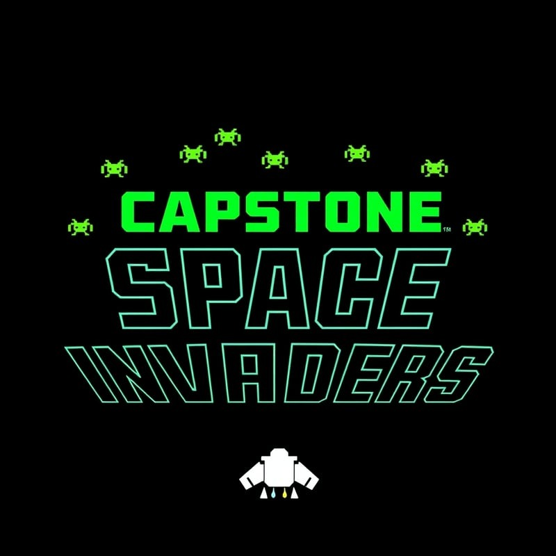

  

<h2 align="center">A little bit about me:</h2>

###

I am a software engineer student from Colombia. I am passionate about programming and I love to learn new things. I have a strong interest in computer science and programming, and I am always looking for new challenges and opportunities to grow my skills and knowledge. I am also a lifelong learner and a curious person, always eager to explore new ideas and technologies. I believe that the key to success is to constantly challenge yourself and to never stop learning. Im cyrrently finishing my deegree in software engineering at the University of <a href="https://www.linkedin.com/school/jala-university">jala university</a> from USA.

 
 

<h2 align="center">Connect with me:</h2>

 
  
  
     

 
 

<h2 align="center">Languages and Tools:</h2>

 

 
 
 
 
 
 
 
 
 

 
 
 
 

 
 
 
 
 
 
 
 
 

 
 
 
 
 

 
 
 

<h2 align="center">Some of my favorite projects:</h2>

 

<table align="center">

<tr>

<td width="25%" align="center">
  
  
</td>

<td width="25%" align="center">
  
 
</td>

<td width="25%" align="center">
  
  
</td>

<td width="25%" align="center">
  
   
</td>
</tr>

<tr> 
<td width="25%" align="center">
  
   
</td>

</tr>  

</table>

 
 
 
 
 

  <h1>🐍 My Contributions 🐍</h1>
   
  
  
     

 

<h1>GitHub :octocat:</h1>

 

 

<h3 align="center">
    
  

</h3>

